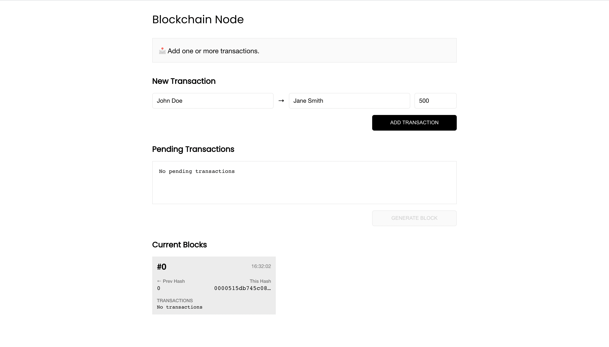

## Blockchain App

A simple blockchain web client developed using Typescript and React

### Acknowledgements

As part of learning by doing, code written in this repository follows implementations from the publication- [TypeScript Quickly by Yakov Fain and Anton Moiseev](https://www.manning.com/books/typescript-quickly)

### Getting Started
- To get a copy of this project: `git clone git@github.com:george-swift/simple-blockchain-app.git`
- Navigate to the server directory and run `npm install` to install server side dependencies
- Run `npm start` to start the server which runs on `port 3000`
- Navigate to the client directory and run `npm install` to install client side dependencies
- Run `npm start` to start the server which automatically redirects to `http://localhost:3001`